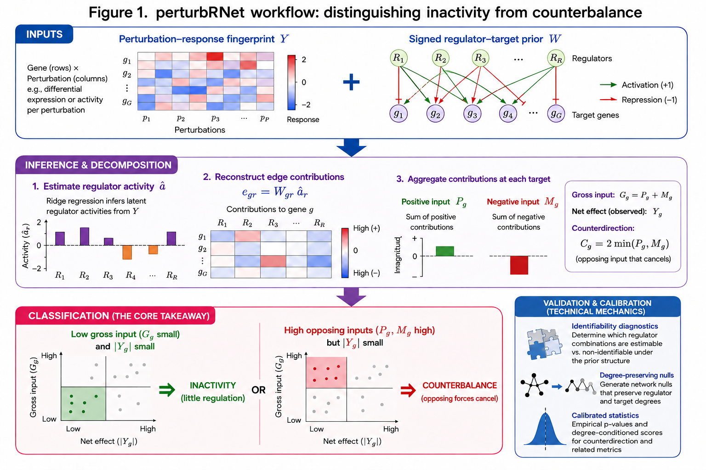

# perturbRNet
[](https://doi.org/10.5281/zenodo.21984685)
<p align="center">
  
</p>

<p align="center">
  <em>Distinguishing regulatory inactivity from hidden counterdirection in perturbation-response profiles</em>
</p>

<p align="center">
  <a href="#installation">Installation</a> •
  <a href="#quick-start-runnable-example">Quick start</a> •
  <a href="#how-to-read-the-results">Interpretation</a> •
  <a href="#validation-and-testing">Validation</a> •
  <a href="#reproducing-the-paper">Paper analyses</a> •
  <a href="#citation">Citation</a>
</p>

---

## Why perturbRNet?

A gene's observed expression response is a **net result**. A small response can
mean either:

1. **regulatory inactivity** — little inferred input reached the target; or
2. **counterbalance** — substantial positive and negative inferred
   contributions opposed one another.

perturbRNet uses a signed regulator–target prior to estimate regulator
activities, reconstruct signed edge contributions, and summarize how those
contributions combine at every target. All network interpretations are
**conditional on the supplied prior, response fingerprint, and fitted model**.
They are not direct measurements of biochemical flux and do not establish
unrestricted causality.

For target gene \(g\):

| Symbol | Output column | Definition | Meaning |
|---|---|---:|---|
| \(P_g\) | `positive_input` | \(\sum_r\max(e_{gr},0)\) | Positive fitted contributions |
| \(M_g\) | `negative_input` | \(\sum_r\max(-e_{gr},0)\) | Magnitude of negative fitted contributions |
| \(N_g\) | `net_input` | \(P_g-M_g\) | Net response fitted by the prior network |
| \(G_g\) | `gross_input` | \(P_g+M_g\) | Total inferred input before cancellation |
| \(C_g\) | `counterdirection` | \(G_g-\|N_g\|\) | Opposing input removed by cancellation |
| \(B_g\) | `balance_fraction` | \(C_g/G_g\) | Fraction of gross input that is opposing |

Here \(e_{gr}=W_{gr}\hat a_r\), where \(W\) is the signed prior and
\(\hat a\) is the fitted regulator-activity vector.

> **Important:** `net_input` is the network's fitted net contribution. It is
> not identical to the observed response. The difference is reported as the
> model residual.

The package also provides:

- **Structural identifiability diagnostics:** rank, effective rank, pairwise
  footprint separation, and regulator grouping. Identical or sign-reversed
  footprints cannot be assigned individual activities from the response.
- **Prior-sign uncertainty analyses:** binary, expected-sign, and sampled-sign
  fits. These are sensitivity tools; uncertain signs should not be treated as
  known.
- **Degree-preserving target calibration:** bipartite rewiring controls for the
  greater opportunity of high-degree targets to accumulate opposing inputs.

## Installation

### From a local clone

From the repository root:

```bash
R CMD INSTALL .
```

or inside R:

```r
# install.packages("remotes")
remotes::install_local(".")
```

### From GitHub

Install the development version from GitHub:

```r
# install.packages("remotes")
remotes::install_github("wei09128/perturbRNet")
```

perturbRNet requires R ≥ 4.1 and `Matrix`. Constructing fingerprints from raw
RNA-seq counts additionally uses Bioconductor packages such as `edgeR` and
`limma`; these are not required when a signed response fingerprint is already
available.

## Required inputs

### Response fingerprint

A numeric matrix with:

- rows = unique target-gene identifiers;
- columns = named perturbation comparisons; and
- values = signed response estimates, such as log2 fold-changes.

The row identifiers must use the same namespace as `prior$target`.

### Signed prior

A data frame containing:

| Column | Description |
|---|---|
| `source` | Regulator identifier |
| `target` | Target identifier matching fingerprint row names |
| `sign` | Nonzero signed effect, ordinarily `+1` or `-1` |

The current manuscript applications use signed transcription-factor regulons.
Other proteins or regulatory programs can be used only when defensible signed
downstream footprints are available.

## Quick start: runnable example

This example creates its own fingerprint and prior, so it can be pasted into a
fresh R session after installation.

```r
library(perturbRNet)

# Six targets measured in two perturbation comparisons.
fingerprint <- matrix(
  c(
     1.20,  0.70,
    -1.00, -0.60,
     0.05,  0.02,
    -0.04,  0.03,
     0.80, -0.40,
    -0.65,  0.50
  ),
  nrow = 6,
  byrow = TRUE,
  dimnames = list(
    paste0("G", 1:6),
    c("perturbation_A", "perturbation_B")
  )
)

# min_targets=2 is used only because this toy network is deliberately tiny;
# real analyses ordinarily use >=10 retained targets per regulator.
prior <- data.frame(
  source = c("R1", "R1", "R1", "R1", "R2", "R2", "R2", "R2"),
  target = c("G1", "G2", "G3", "G5", "G2", "G3", "G4", "G6"),
  sign   = c(   1,   -1,    1,    1,   -1,    1,   -1,    1)
)

fit <- prn_build(
  fingerprint,
  prior,
  min_targets = 2,
  evidence_level = "toy_prior_informed"
)

# One summary row per comparison.
prn_summary(fit)

# Target-by-comparison decomposition.
targets <- prn_counterdirection(fit)
targets <- targets[order(-targets$counterdirection), ]
head(targets)

# Edge-level signed contributions.
head(prn_edge_table(fit))

# Determine which regulators are structurally distinguishable.
diagnostic <- prn_identifiability(fit)
diagnostic$global
head(diagnostic$regulator)

# Group regulators whose footprints cannot be interpreted separately.
groups <- prn_group_regulators(fit)
groups$groups
```

### Optional degree calibration

Calibration refits many rewired networks and is intentionally not part of the
fast toy example. Calibrate one comparison at a time when independently
selected comparisons have different ridge penalties:

```r
fit_A <- prn_build(
  fingerprint[, "perturbation_A", drop = FALSE],
  prior,
  min_targets = 2,
  evidence_level = "toy_prior_informed"
)

# Use a small number only to check that the workflow runs.
calibration_quick <- prn_calibrate_targets(fit_A, n_null = 10)

# Use substantially more draws for interpretation; 200 gives a minimum
# attainable empirical upper-tail probability of 1/(200+1).
# calibration_final <- prn_calibrate_targets(fit_A, n_null = 200)
```

## How to read the results

Yes—this section is necessary. Without it, users can easily mistake fitted
contributions for direct biochemical measurements or treat a high balance
fraction based on tiny inputs as a strong event.

`prn_counterdirection(fit)` returns one row per target and comparison. Principal
columns include:

| Output | Interpretation |
|---|---|
| `observed_response_z` | Standardized observed response used by the fit |
| `positive_input` | Sum of positive fitted edge contributions |
| `negative_input` | Magnitude of negative fitted edge contributions |
| `net_input` | Network-fitted positive minus negative contribution |
| `gross_input` | Total fitted input before cancellation |
| `counterdirection` | Magnitude of opposing fitted input |
| `balance_fraction` | Relative balance; interpret only with a magnitude statistic |
| `hidden_compensation` | Ranking heuristic, **not** a p-value |
| `residual` | Observed response not captured by the fitted network component |
| `evidence_level` | Claim label supplied to or generated by the analysis |

### Practical interpretation

| Pattern | Compatible interpretation |
|---|---|
| Small gross input + small counterdirection | Regulatory inactivity under the supplied prior |
| Large gross input + large counterdirection + small fitted net input | Active counterbalance |
| Large fitted net input + low counterdirection | Predominantly direct/reinforcing response |
| Large balance fraction + tiny gross input | Weak event; do not call strong counterbalance |
| Large residual | The prior-aligned component explains little of the observed target response |

For heterogeneous real networks, biological target claims should ordinarily
require:

1. a nontrivial gross-input or counterdirection magnitude;
2. a high balance fraction when balance is relevant;
3. degree-conditioned calibration against rewired networks;
4. correction for testing many target–comparison rows; and
5. external experimental support where causal language is intended.

Positive and negative fitted contributions describe the sign of
\(W_{gr}\hat a_r\). They should not be relabeled mechanically as biochemical
activation and repression: for example, reduced activity of a repressor can
produce a positive fitted contribution.

## What perturbRNet does not claim

- It does not infer an unrestricted causal gene-regulatory network from
  expression alone.
- It does not make identical or sign-reversed regulator footprints individually
  identifiable.
- Ridge regularization stabilizes a solution; it does not prove that the
  selected individual regulator activities are biologically unique.
- A high raw counterdirection score is not sufficient for a gene-level claim
  when target degree varies.
- An empirical calibration probability is conditional on the null construction
  and is not automatically adjusted for multiple testing.

## Validation and testing

The manuscript version was evaluated using controlled simulations,
negative-binomial counts-to-network simulations, estimator comparisons,
destroyed-information controls in NASA and AZD/shATM RNA-seq data, and held-out
combinatorial CRISPRa responses from Norman *et al.*

The last recorded version-0.5.0 package check completed with:

```text
testthat: 47 passed, 0 failed
R CMD check --no-manual: Status OK
```

Test the **current checkout** rather than relying on that recorded result:

```bash
cd /path/to/PRNet

Rscript -e 'testthat::test_local(".")'

R CMD build .
R CMD check --no-manual perturbRNet_*.tar.gz
```

Review `00check.log` before release.

## Reproducing the paper

The repository contains package code and analysis scripts for the simulation
benchmarks, NASA radiation cohorts, AZD/shATM case study, Norman held-out
validation, and manuscript figures. Large or controlled datasets are not
assumed to be stored in Git; follow the data-access instructions in the case
study directories.

Expected layout:

```text
R/                         package source
man/                       function documentation
tests/testthat/             unit tests
inst/benchmarks/            simulation and null benchmarks
inst/case_studies/
  nasa/                     NASA fingerprint and PRN analyses
  azd_shatm/                reversal, calibration and restoration analyses
  norman/                   held-out combinatorial validation
manuscript/
  figures/                  figure scripts and rendered panels
  tables/                   manuscript table scripts
```

See `manuscript/README.md` for the exact command sequence and mapping from
analysis outputs to manuscript figures and tables. Before claiming complete
reproducibility, verify that this file, every referenced script, environment or
package-version record, data-download instruction, and fixed seed are present
in the public repository.

## Citation

Until a preprint or journal record is available, please cite:

> Chen W, Lu X. *perturbRNet distinguishes regulatory inactivity from hidden
> counterdirection in perturbation-response profiles.* Manuscript in
> preparation (2026).

```bibtex
@unpublished{chen_perturbrnet,
  title  = {perturbRNet distinguishes regulatory inactivity from hidden counterdirection in perturbation-response profiles},
  author = {Chen, Wei and Lu, Xiaohong},
  year   = {2026},
  note   = {Manuscript in preparation}
}
```

## License

See [`LICENSE`](LICENSE). Before public release, verify that it contains an
OSI-approved software license compatible with all bundled code and data.

## Contact

Wei Chen — wei09128@gmail.com
Louisiana State University Health Sciences Center, Shreveport, Louisiana, USA
